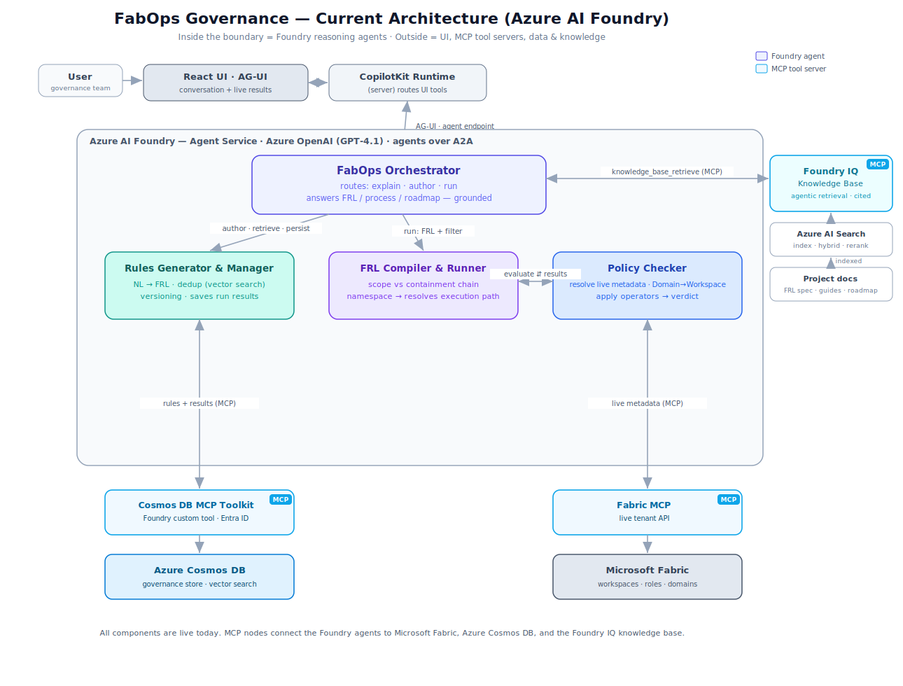
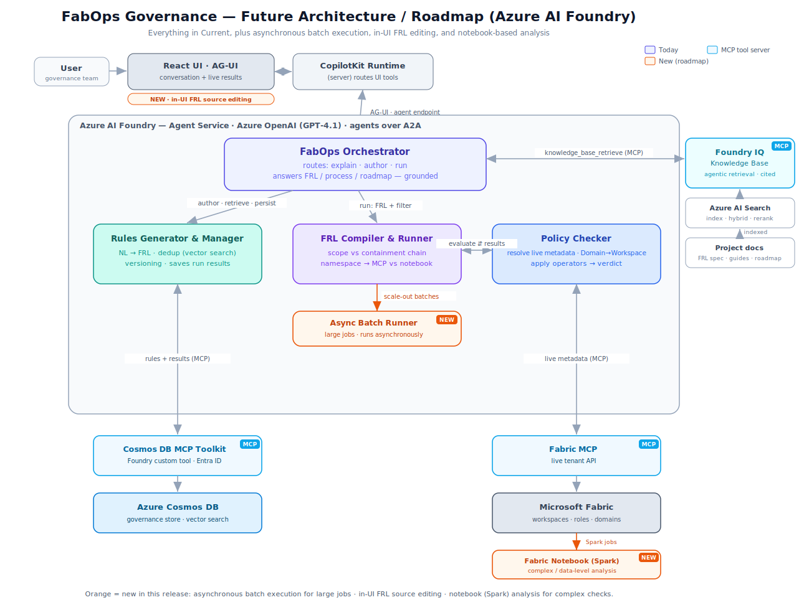

# Architecture

FabOps is a multi-agent governance system for Microsoft Fabric, built on **Azure AI Foundry**. This document describes the design — why each agent exists, what it owns, how the pieces compose over A2A and MCP, and what is current versus on the roadmap. The final section explains how *this repository* (the UI and its API) fits into the larger solution.

The system at a glance:



## Design principles

The architecture is shaped by three observations about Fabric governance that don't fit a single-agent design:

1. **Governance rules are a language, not free text.** "Every workspace must have at least two admin groups" is a rule with structure: a target type (`Workspace`), a property (`Entra group assignments where role = admin`), and a constraint (`count >= 2`). Treating governance as natural language alone loses this structure. FabOps introduces the **FabricGuard Rule Language (FRL)** — a small, interpreted DSL that captures the structure while remaining human-readable. See [`frl-language.md`](frl-language.md).

2. **Different rules need different inspection mechanisms.** Some rules are answered by reading metadata (Fabric REST). Some need lineage traversal (find all tables that are sources to materialized lake views). Some need actual code execution against the data plane (count files in a Delta directory). One agent doing all three becomes a god-prompt that can't be reasoned about. FabOps splits the work by responsibility and routes each `CHECK` by its property namespace.

3. **Governance is iterative.** Rules evolve. The same intent gets re-described in different terminology by different stakeholders. Without a way to detect "this is a new version of an existing rule" vs "this is a duplicate" vs "this is genuinely new," the rule store devolves into noise. FabOps makes versioning, semantic deduplication, and version-history analysis first-class.

## Platform and communication model

- **Runtime:** Azure AI Foundry **Agent Service**. Each agent is a Foundry agent backed by **Azure OpenAI GPT-4.1**.
- **Agent ↔ agent:** **A2A** (Agent2Agent), call/return. The Orchestrator calls a specialist and gets its reply back; it never *transfers* the conversation, so the user always talks to the Orchestrator.
- **Agent ↔ tools / data:** **MCP** (Model Context Protocol). Cosmos DB, Fabric, and the knowledge base are all reached as MCP tool servers.
- **Agent ↔ UI:** **AG-UI**, an event stream (over SSE) that plugs into the runtime as a protocol-adapter hook. The React front end uses a CopilotKit runtime to route UI tools and render generative UI.

## Agents

### FabOps Orchestrator

**Role:** the front door. Routes the user's intent into one of three lanes — **explain**, **author**, or **run** — and stays in front of the user, weaving each specialist's reply into its own response.

**Owned operations:**

- Classify intent: a question about the system/FRL/process/roadmap (explain), rule creation/management (author), or rule evaluation (run).
- For *author* intents, relay to the Rules Generator & Manager and faithfully return what it shows — including the FRL code — so the user always sees the rule before it is saved.
- For *run* intents, drive the evaluation pipeline (below) and present the outcome.
- For *explain* intents, answer from the **Foundry IQ knowledge base** so the explanation is grounded and cited.
- Generate the `run_id`, compose per-object results from the evaluator's output, and ensure results are persisted before presenting.

**Tools:** A2A links to the Rules Generator & Manager and the FRL Compiler & Runner; `knowledge_base_retrieve` (MCP) for grounded answers. It does **not** compile FRL, call the store, or call the Policy Checker directly.

**Model:** Azure OpenAI GPT-4.1.

### Rules Generator & Manager

**Role:** natural-language → FRL rule generator and rule-lifecycle manager; also the persistence path for run results.

**Owned operations:**

- Translate user intent into syntactically-valid FRL.
- Reconcile user terminology against Microsoft Fabric's official object/property names (`MLV` ≈ `MaterializedLakeView`, `CDF` ≈ `delta.enableChangeDataFeed`, `AD groups` ≈ `Entra security groups`).
- **Vector-search the existing `governance-rules` container in Cosmos DB before saving** a new rule, to detect potential duplicates.
- Analyze whether the closest match is the **current** version of an existing rule or an **older** one, and explain the version history before deciding to save as a new rule, a new version, or a rollback.
- Refuse to update rules in place — only create new rules or new versions. Immutable history is the contract.
- List, count, show, search, and retrieve the stored FRL **source** of rules.
- **Persist run results** (`save_results`).

**Tools:** the **Azure Cosmos DB MCP Toolkit** for reads, schema discovery, and `vector_search`; a dedicated **write tool** for the versioned writes (`save_rule`, `save_results`) the toolkit does not expose.

**Model:** Azure OpenAI GPT-4.1.

### FRL Compiler & Runner

**Role:** turn a rule's FRL **source** plus an optional **scope/filter** into per-object results. This is the agent that owns both compilation and execution, so the Orchestrator never has to compile FRL or talk to the evaluator directly.

**Owned operations:**

- Resolve the rule's **scope against the Fabric containment chain** (Domain → Workspace → item), applying any filter the user gave (e.g. "only the InterWorks domain").
- Classify each `CHECK` by its **property namespace** to choose the execution path (MCP-direct today; notebook on the roadmap).
- **Compile** the FRL source into the Policy Checker's executable `evaluate` spec (`task` / `rule_id` / `traverse` / `checks`), or return a `compile_error`.
- **Run** the compiled spec against the live tenant through its Policy Check link and return **per-object pass/fail/error results**.

**Why a dedicated agent:** a live Foundry trace showed the orchestrator sending *natural language* to the evaluator, which expects a structured spec, and erroring. Externalizing compilation made the contract explicit and the failure attributable. The Compiler & Runner compiles the **v0.2 FRL grammar** (`RULE { APPLIES_TO … CHECK … }`); rules stored in an older dialect must be re-authored to v0.2.

**Model:** Azure OpenAI GPT-4.1.

### Policy Checker

**Role:** inspect the live Microsoft Fabric tenant and return a verdict per object.

**Owned operations:**

- Walk each object the rule applies to. A `Domain` scope is resolved to its workspaces by calling **`list_workspaces_in_domain`** (the Fabric MCP has no direct Domain-traversal tool), and traversal continues from that workspace set.
- Read the metadata each `CHECK` needs through the Fabric MCP layer.
- Apply the rule's operators and return **pass / fail / error** per object, with the reasoning behind each verdict.

**Tools:** the **Fabric MCP** server (Fabric REST as MCP tools) plus the `list_workspaces_in_domain` custom tool.

**Model:** Azure OpenAI GPT-4.1.

## Evaluation pipeline

```
User: "run the admin-groups rule for the InterWorks domain"
  │
  ▼
FabOps Orchestrator
  │  1. retrieve the rule's FRL source + finding + severity
  ▼
Rules Generator & Manager  ──(Cosmos DB MCP Toolkit)──▶  governance-rules
  │  returns: rule_id, FRL source, FINDING template, severity
  ▼
FabOps Orchestrator
  │  2. hand source + filter ("domain:InterWorks")
  ▼
FRL Compiler & Runner
  │  compile FRL → evaluate spec; run via Policy Check
  ▼
Policy Checker  ──(Fabric MCP, list_workspaces_in_domain)──▶  Microsoft Fabric
  │  per-object pass/fail/error
  ▼
FRL Compiler & Runner ──▶ FabOps Orchestrator
  │  3. generate run_id; compose one result per object
  │  4. persist (MANDATORY, before presenting)
  ▼
Rules Generator & Manager  ──(write tool)──▶  governance-results
  │  success confirmation
  ▼
FabOps Orchestrator  ──▶  present (overall score + per-object reason; name the scoped subset)
```

A run that is not confirmed-saved is never presented as saved. Every result carries both `rule_id` and `item_id`; the save step rejects any result missing either.

## External surfaces

### Azure Cosmos DB (governance store)

A NoSQL database, **`fabops-governance`**, with two containers:

**`governance-rules`** — partition key **`/rule_id`** (all versions of a rule share one logical partition, so version queries and the "retire current + insert new" step stay single-partition and atomic). Document id `<rule_id>_v<version>`. Fields: `rule_id`, `version`, `is_current`, `name`, `description`, `nl_intent`, `frl_code`, `tags[]`, `created_at`, `created_by`, and **`nl_intent_vector`** for vector search.

**`governance-results`** — partition key **`/run_id`** (results are written and read per run). Fields: `run_id`, `rule_id`, `item_id`, `item_name`, `item_type`, `status`, `finding`, `severity`, `created_at`, and the run-level **`scope` / `filter`** that records which subset the run covered.

A container **vector embedding policy** on `nl_intent_vector` (cosine distance) plus a vector index serves the semantic "find a rule by meaning" lookup; combined with text search it gives hybrid recall for dedup and retrieval. Embeddings are produced by an Azure OpenAI embedding model (e.g. `text-embedding-3-small`) at write time.

**Access split:** the **Azure Cosmos DB MCP Toolkit** (deployed to Azure Container Apps, added to Foundry as a custom tool, authenticated with Microsoft Entra ID) provides reads, schema discovery, and `vector_search`. The versioned writes are **not** in the toolkit and are provided by a dedicated **write tool** (an Azure Function using the Cosmos SDK + managed identity) that preserves the `save_rule` / `save_results` contracts:

- **`save_rule`** — embed `nl_intent`; in one transactional batch within `/rule_id`, set the prior current document `is_current=false` and insert the new `<rule_id>_v<version>` with `is_current=true`.
- **`save_results`** — bulk upsert the results array, partitioned by `run_id`.

### Foundry IQ knowledge base

A **Foundry IQ** knowledge base backed by **Azure AI Search** (index, hybrid retrieval, reranking) over the project's own documents (the FRL spec, guides, roadmap). Exposed to the agents through `knowledge_base_retrieve` (MCP); returns cited, agentic retrieval results. This is what makes the Orchestrator's *explain* answers grounded rather than improvised.

### Fabric MCP

The **Fabric MCP** server exposes Fabric REST as MCP tools (workspaces, roles, domains, items) for the Policy Checker. A companion custom tool, **`list_workspaces_in_domain(domain)`**, performs the two admin-API calls that turn a domain *display name* into the workspaces assigned to it; this is how domain-scoped runs work. (The admin calls require the Fabric connection's identity to hold `Tenant.Read.All`.)

## Why this composition, not one mega-agent

A single agent with every tool attached (store, Fabric REST, Fabric notebooks, lineage walks) frequently picks the wrong tool path for a given `CHECK`. Splitting by responsibility gives each agent a single mental model and eliminates the most common failure class. It also produces cleaner audit trails: when a rule fails to evaluate, the failure is attributable to a specific agent and a specific tool call, not buried inside a god-agent's reasoning. The trade-off is orchestration complexity — the Orchestrator owns routing, and the FRL Compiler owns the compile/run contract — which we accept because explicit routing is easier to reason about than implicit prompt-driven routing inside one mega-agent.

## Current vs. roadmap

**Current — live in the Azure AI Foundry build:**

- FabOps Orchestrator, Rules Generator & Manager, FRL Compiler & Runner, Policy Checker (Foundry agents over A2A).
- Azure Cosmos DB governance store (`governance-rules` + `governance-results`) with vector search; Cosmos DB MCP Toolkit (reads) + write tool (`save_rule` / `save_results`).
- Foundry IQ + Azure AI Search knowledge base via `knowledge_base_retrieve`.
- Fabric MCP + `list_workspaces_in_domain` for domain-scoped runs.
- React + AG-UI + CopilotKit front end (this repository).
- MCP-direct evaluation path; bounded demo on the **InterWorks** domain.



**Roadmap — next releases:**

- **Async Batch Runner** — large jobs (many objects / many rules) run asynchronously and scale out.
- **In-UI FRL source editing** — edit a rule's FRL source directly in the React UI.
- **Fabric Notebook (Spark) analysis** — the data-plane path: the `delta.*`, `schema.*`, `access.*`, and `spark.*` namespaces run as Spark jobs in a Fabric notebook.
- **Execution router** — integrate MCP-direct / notebook / batch into one routed model.
- **Filtered execution + subset-aware results** — persist the executed subset on every run and segregate/flag comparisons across different subsets.
- **Scope validation** — refuse an over-broad whole-tenant run and ask the user to narrow it (suggest a domain/subset).
- **Pass-through authentication** to Fabric and to the store, **guardrails** on the demo Fabric environment, **OpenAPI tool isolation** for Fabric and store calls, **access to custom Fabric environments** beyond the demo tenant, and a **short, typable rule key** (`R1`, `R2`, …).

See [`known-issues.md`](known-issues.md) for platform/tooling caveats and [`security.md`](security.md) for the auth model and its trade-offs.

---

## This repository — the UI and its API

The agents and MCP tool servers described above are the larger FabOps solution. **This repository implements one component of it: the user interface and a thin API relay.** It is the Azure-native conversion of the reference project's `FabOpsUI` (a React SPA + small backend) to a Visual-Studio-standard Azure stack. It contains none of the agent logic; it reaches the deployed agent through one configured AG-UI endpoint URL.

```
┌──────────────────────────────┐      ┌──────────────────────────────────┐      ┌─────────────────────────┐
│  Azure Static Web App        │      │  Azure Functions (.NET 8 isol.)  │      │  The agent system       │
│  FabOps.Web (Vite + React)   │      │  FabOps.Api                      │      │  (the rest of FabOps,   │
│                              │ POST │  GET  /api/config   readiness    │      │   reached via Agent:Url)│
│  CopilotKit (AG-UI)          │──────│  GET  /api/secrets  MSAL ids     │      │                         │
│   useComponent ×6 render     │ SSE  │  POST /api/agent ──(relay)───────┼──────┼─▶ FabOps Orchestrator    │
│   tools, MSAL sign-in        │◄─────│  body + SSE pass through         │      │   over an AG-UI endpoint│
└──────────────────────────────┘      └──────────────────────────────────┘      └─────────────────────────┘
```

**The three endpoints (same contracts as the reference backend):**

| Endpoint | Response | Notes |
|---|---|---|
| `GET /api/config` | `{ "agent_url": string \| null }` | the configured `Agent:Url`; `null` makes the chat page show "agent not configured" |
| `GET /api/secrets` | `{ "tenant_id", "client_id", "client_secret_set" }` | MSAL sign-in config; identifiers only — the secret never leaves the server |
| `POST /api/agent` | `text/event-stream` | transparent AG-UI relay (below) |

**A chat turn, end to end.** `CopilotChat` posts the AG-UI `RunAgentInput` (full message history, thread id, run id, and the declarations of the six render tools) to `POST /api/agent` with the signed-in user's bearer token. The Function optionally validates the platform principal, then forwards the body **byte-for-byte** to `Agent:Url` with `Accept: text/event-stream`. The agent's SSE events stream back through the relay, flushed per chunk, so the browser sees text deltas and tool calls as they are produced. When the agent calls one of the six render tools (`render_table`, `render_donut`, `render_chart`, `render_card`, `render_badge`, `render_rule_source`), CopilotKit renders the matching React component inline; on failure the relay emits an AG-UI `RUN_ERROR` event. The relay holds no conversation state and interprets no payloads — protocol evolution between CopilotKit and the agent does not require touching this API.

**The generative-UI render tools** are display-only frontend components registered as agent tools. Their contract is [`ui-render-primitives.md`](ui-render-primitives.md); how the agent should use them (for the agent team's prompt) is [`ui-rendering-skill.md`](ui-rendering-skill.md).

**Security (this component).** SPA sign-in uses MSAL (popup → redirect fallback). In Azure, the Function App's App Service Authentication validates bearer tokens at the platform; with `Entra:RequireAuthentication=true` the relay refuses requests without a validated principal (`/api/config` and `/api/secrets` stay anonymous to bootstrap sign-in, identifiers only). Any downstream agent secret lives in Function App settings, never in the browser. Full solution-wide auth model: [`security.md`](security.md).

**Build / run / deploy** and every deliberate divergence from the reference project are in [`DECISIONS.md`](DECISIONS.md); a quick start is in the repository [`README.md`](../README.md). Note that the SPA calls the Function App origin **directly**, not through the Static Web Apps `/api` proxy, whose hard 45-second limit would cut off long agent runs.
